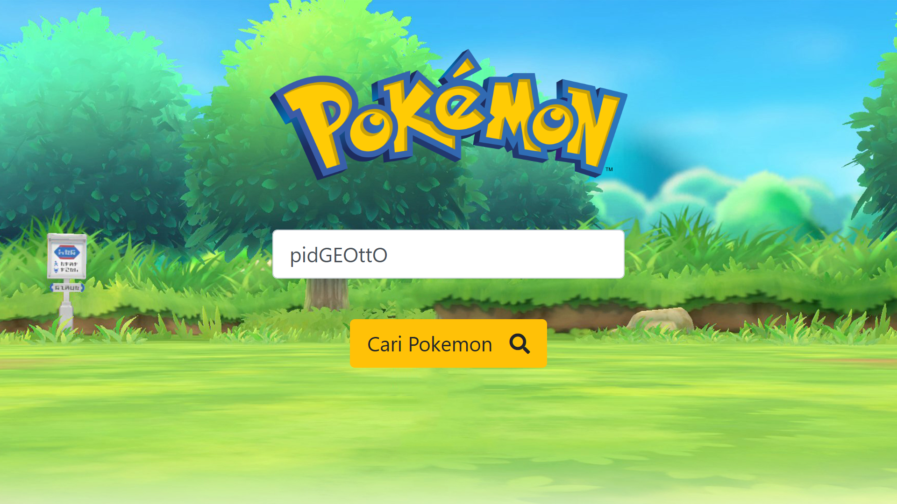

# Soal Ujian Data Science - Machine Learning


## **Soal 1 - Hunting Pemain Basket 🏀**


Anda adalah seorang manager klub basket ternama yang ingin merekrut pemain basket muda berbakat. Pemain yang Anda targetkan untuk direkrut memiliki kriteria sebagai berikut:

- [x] Usia (__Age__) __<= 25__ tahun, 
- [x] Tinggi badan (__Height__) __>= 180__ cm,
- [x] Berat badan (__Weight__) __<= 90__ kg,
- [x] Rata-rata point (__Average points scored__) __>= 6__, dan
- [x] Rata-rata rebound (__Average rebounds grabbed__) __>= 3__.

Tersedia __1 buah dataset (.csv)__ yang memuat data lengkap pemain basket liga profesional __NBA__ (_National Basketball Association_). Unduh dataset via Kaggle: [klik di sini](https://www.kaggle.com/justinas/nba-players-data). Dengan memanfaatkan dataset tersebut, buatlah sebuah file __Jupyter notebook (.ipynb)__ yang berisi model machine learning untuk mengklasifikasikan data __pemain muda Indonesia di bawah ini__ apakah tergolong pemain yang patut Anda rekrut atau tidak:

Name | Club | Country | Age | Height | Weight | Avg Points | Avg Rebounds 
--|--|--|--|--|--|--|--
Andakara Prastawa Dyaksa | Pelita Jaya Bakrie |  Indonesia | 24 | 190 | 90 | 7 | 6
Reggie Mononimbar | Pelita Jaya Bakrie |  Indonesia | 21 | 185 | 86 | 6 | 3
Hardianus Lakudu | Satria Muda Pertamina Jakarta |  Indonesia | 23 | 178 | 83 | 10 | 3
Kevin Yonas Sitorus | Satria Muda Pertamina Jakarta |  Indonesia | 26 | 185 | 75 | 11 | 4
Arki Dikania Wisnu | Satria Muda Pertamina Jakarta |  Indonesia | 20 | 183 | 80 | 5 | 2
Laurentius Steven Oei | Satria Muda Pertamina Jakarta |  Indonesia | 21 | 191 | 85 | 4 | 10
Mei Joni | Stapac |  Indonesia | 25 | 188 | 90 | 7 | 5
Vincent Rivaldi Kosasih | Stapac |  Indonesia | 23 | 179 | 87 | 1 | 2
Hardian Wicaksono | Pacific Caesar Surabaya |  Indonesia | 21 | 177 | 80 | 9 | 8
Brandon Jawato | Louvre Surabaya |  Indonesia | 24 | 182 | 85 | 6 | 5

__Requirements:__

- Buatlah sebuah file __Jupyter Notebook (.ipynb)__.
- Download & gunakan dataset [NBA players](https://www.kaggle.com/justinas/nba-players-data). Bersihkan data, lakukan __standardisasi__ & split menjadi __82%__ untuk training set & __18%__ untuk testing set.
- Buatlah __3 model__ machine learning untuk klasifikasi (pilihan  model bebas), lakukan __hyperparameter tuning__ untuk menentukan nilai parameter terbaik tiap model.
- Gunakan parameter terbaik model untuk melakukan prediksi pada testing set. Kemudian hitung __evaluation metrics__ tiap model. Metrics yang wajib dihitung yakni: __balanced accuracy__, __precision__, __recall__, __F1 score__ & __ROC AUC score__.
- Bandingkan nilai tiap model & gunakan model terbaik yang diperoleh, untuk mengklasifikasi data pada tabel pemain muda Indonesia di atas, manakah pemain yang patut direkrut atau tidak. Tampilkan hasilnya dalam sebuah __dataframe__.

✅ _Commit & push source code jawaban soal ini ke __Github__ Anda, buatlah repo dengan nama __Ujian_Pemain_Basket__. Kemudian lampirkan __url link repo Github__ Anda via email ke lintang@purwadhika.com!_

#

                  


## **Soal 2 - Pokemon Recommendation**

Disediakan sebuah dataset Pokemon: [unduh di sini](https://www.kaggle.com/abcsds/pokemon), beserta Pokemon API: [akses di sini](https://pokeapi.co/). Buatlah sebuah __*content-based filtering recommender system*__ dengan menggunakan __Flask__, yang dapat memfasilitasi user untuk menyebutkan Pokemon favoritnya & menyajikan rekomendasi __6 Pokemon__ berdasarkan feature: __Type 1__, __Generation__ & __Legendary__ Pokemon. Aplikasi yang dibuat harus memenuhi syarat minimal berikut:

1. Server aplikasi akan berjalan di __localhost:5000__ dan ketika user melakukan GET request via browser akan tampil sebuah halaman __HTML__ sederhana yang memuat __1 buah text input__ dan __1 buah button__. Desain tampilan HTML tidak harus sama seperti contoh soal, utamakan fitur!

    

2. User dapat memasukkan nama Pokemon favoritnya ke dalam text input yang sudah disediakan. Saat user menekan tombol __"Cari Pokemon"__, jika data ditemukan, maka user akan di-redirect ke __localhost:5000/hasil__ yang berisi halaman __HTML__, yang menampilkan data seputar Pokemon favorit user, disertai dengan data __6 Pokemon__ yang direkomendasikan berdasarkan __type__, __generasi__ & __legend__. Data yang ditampilkan untuk tiap Pokemon minimal: _nama_, _gambar_, _tipe_, _generasi_ & _legendary_. Gambar Pokemon tidak terdapat pada dataset, tapi dapat diambil dari [Pokemon API](https://pokeapi.co/). Halaman ini juga dilengkapi __1 buah button__ untuk kembali ke halaman awal. Desain tampilan HTML tidak harus sama seperti contoh soal, utamakan fitur!

    - Contoh jika user memfavoritkan __Pikachu__ :
    
        

        

    - Contoh jika user memfavoritkan __Pidgeotto__ :

        

        

4. Namun jika Pokemon favorit user tidak ditemukan, maka user akan di-redirect ke halaman __HTML__ yang memberikan informasi bahwa data tidak ditemukan. Halaman ini juga dilengkapi __1 buah button__ untuk kembali ke halaman awal. Desain tampilan HTML tidak harus sama seperti contoh soal, utamakan fitur!

    

⚠ [Pokemon API](https://pokeapi.co/) memiliki batasan __100 API request per IP address per menit__. Jika Anda mengalami kendala dikarenakan telah mencapai limit, maka tunggulah sejenak beberapa menit, lalu coba call API kembali.

✅ _Commit & push source code jawaban soal ini ke __Github__ Anda, buatlah repo dengan nama __Ujian_Pokemon_Recommendation__, kemudian lampirkan __url link repo Github__ Anda via email ke lintang@purwadhika.com!_

                  

#

# Remedial Data Science - Machine Learning

## **Soal - Pokemon Battle**

Disediakan __beberapa dataset__ seputar data spesies Pokemon beserta history pertandingan antar Pokemon. File **_pokemon.csv_** berisi data lengkap 800 spesies Pokemon, sedangkan file _**combats.csv**_ berisi data historis duel Pokemon beserta pemenangnya. Unduh dataset: [klik sini](https://www.kaggle.com/sekarmg/pokemon).

Dengan dataset tersebut, buatlah sebuah __file Notebook (.ipynb)__ berisi model machine learning (model bebas) yang dapat memprediksi pemenang dari duel antara 2 spesies Pokemon.

__Requirements:__

- Buat sebuah file __Notebook__ (_.ipynb_).
- Unduh & gunakan dataset: [klik sini](https://www.kaggle.com/sekarmg/pokemon).
- Buat model yang dapat memprediksi pemenang duel antara 2 Pokemon.
- Tentukan & hitung metriks evaluasinya.
- Untuk memprediksi, buatlah sebuah _function_ dengan 2 parameter nama Pokemon, misal ```def battle(pokemonA, pokemonB)```.
- Jika _function_ dieksekusi akan menampilkan hasil prediksi pemenang duel beserta _probability_ kemenangannya. Contoh eksekusi:

    ```python
    battle('PIKACHU', 'MEWTWO')
    battle('PIKACHU', 'CHARIZARD')
    battle('CHARMANDER', 'DITTO')
    battle('AGUMON', 'PATAMON')
    ```

    Output yang diharapkan:

    ```python
    Winner: 92% MEWTWO
    Winner: 88% CHARIZARD
    Winner: 78% DITTO
    Maaf, data tidak ditemukan.
    ```

#

✅ _Commit & push source code jawaban soal ini ke __Github__ Anda, buatlah repo dengan nama __Remedial_Pokemon_Battle__, kemudian lampirkan __url link repo Github__ Anda via email ke lintang@purwadhika.com!_

#

### *__#HappyCoding__* :relaxed:

#### Lintang Wisesa :love_letter: _lintangwisesa@ymail.com_

[Facebook](https://www.facebook.com/lintangbagus) | 
[Twitter](https://twitter.com/Lintang_Wisesa) |
[Google+](https://plus.google.com/u/0/+LintangWisesa1) |
[Youtube](https://www.youtube.com/user/lintangbagus) | 
:octocat: [GitHub](https://github.com/LintangWisesa) |
[Hackster](https://www.hackster.io/lintangwisesa)